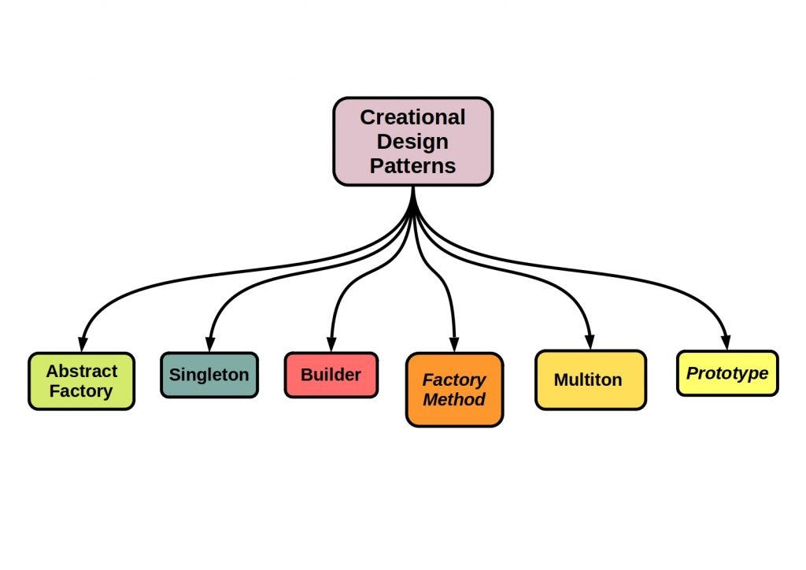

តើអ្វីគឺជា Creational Pattern ?

Creational Pattern ជាវិធីសាស្រ្តដែលផ្តល់នូវរចនាសម្ព័ន្ធអំពីការបង្កើត Object ដែលបង្កើននូវ
ភាពបត់បែន និង អាចប្រើបានច្រើនដងនូវកូដដែលបានបង្កើតឡើង ។

Creational Pattern: នៅក្នុង Creational Pattern វាមាននូវរបៀបមួយចំនួនក្នុងការបង្កើត Object ។
Factory Method, Abstract Factory, Builder, Prototype, និង Singleton.

---

Creational Pattern ត្រូវបានគេបែងចែកជា 5
* Factory Method
* Builder Pattern
* Singleton Pattern
* Prototype Pattern
* Abstraction Factory