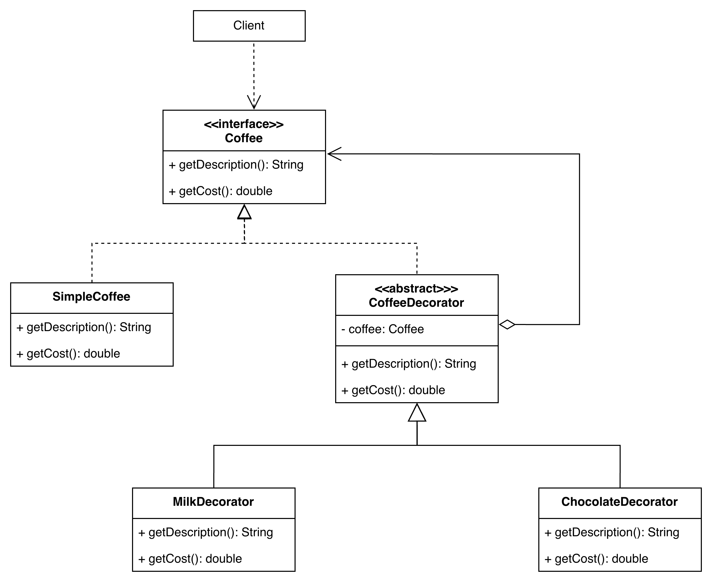

## Decorator Pattern


- https://medium.com/@thecodebean/decorator-design-pattern-implementation-in-java-af632380e249
- 
Decorator Pattern គឺជា Structural Design Pattern មួយ ដែលអនុញ្ញាតឱ្យយើង បន្ថែម behavior (មុខងារ) ទៅលើ object មួយ ដោយ មិនប្តូរ class ដើម នោះទេ។

គំនិតសំខាន់:
> Wrap object ដើមជាមួយ object ថ្មី (Decorator) ដើម្បីបន្ថែម functionality។

ពេលណាគួរប្រើ Decorator Pattern?

យើងគួរប្រើ Decorator Pattern នៅពេល៖
- ចង់បន្ថែម feature ថ្មីទៅ object runtime 
- មិនចង់បង្កើត subclass ច្រើន 
- ចង់បន្ថែម behavior ដោយ flexible

Concept Structure

Decorator Pattern មាន 4 សមាសភាគសំខាន់:
- Component – Interface ឬ Abstract class 
- ConcreteComponent – Class ដើម 
- Decorator – Abstract class ដែល wrap Component 
- ConcreteDecorator – Class ដែលបន្ថែម behavior

Example : Coffee Shop (Java)

យើងមាន Coffee base ហើយអាចបន្ថែម:
- Milk 
- Sugar 
- Chocolate

1. Coffee interface
```java
public interface Coffee {
    String getDescription();
    double getCost();
}
```

2. Concrete Component
```java
public class SimpleCoffee implements Coffee {
    @Override
    public String getDescription(){
        return "Simple Coffee";
    }
    
    @Override
    public double getCost(){
        return 2.6;
    }
}
```
3. Decorator Abstraction class
```java
public abstract class CoffeeDecorator implements Coffee {
    protected Coffee coffee;
    
    public CoffeeDecorator(Coffee coffee){
        this.coffee = coffee;
    }

    @Override
    public String getDescription(){
        return coffee.getDescription();
    }

    @Override
    public double getCost(){
        return coffee.getCost();
    }
}
```

4. Concrete Decorator

Milk Decorator
```java
public class MilkDecorator extends CoffeeDecorator {
    
    public MilkDecorator(Coffee coffee){
        super(coffee);
    }

    @Override
    public String getDescription(){
        return coffee.getDescription() + " Milk";
    }

    @Override
    public double getCost(){
        return coffee.getCost() + 0.5;
    }
}
```


Chocolate Decorator
```java
public class ChocolateDecorator extends CoffeeDecorator {
    
    public ChocolateDecorator(Coffee coffee){
        super(coffee);
    }

    @Override
    public String getDescription() {
        return coffee.getDescription() + ", Chocolate";
    }

    @Override
    public double getCost() {
        return coffee.getCost() + 0.7;
    }
    
}
```


5. Main class
```java
public class Main {
    public static void main(String[] args) {

        Coffee coffee = new SimpleCoffee();
        coffee = new MilkDecorator(coffee);
        coffee = new ChocolateDecorator(coffee);

        System.out.println("Description: " + coffee.getDescription());
        System.out.println("Total Cost: $" + coffee.getCost());
    }
}
```


Example output : 
```bash
Description: Simple Coffee, Milk, Chocolate
Total Cost: $3.2
```

### Explanation Step-by-Step

```java
Coffee coffee = new SimpleCoffee(); // Create Coffee base 2.00$

coffee = new MilkDecorator(coffee); // Wrap coffee ជាមួយ Milk (+0.5)

coffee = new ChocolateDecorator(coffee); // Wrap ម្តងទៀត (+0.7)
```
Final object = Chocolate(Milk(SimpleCoffee))

---

Why Not Just Use Inheritance?

បើមិនប្រើ Decorator Pattern អ្នកត្រូវបង្កើត class ច្រើនដូចជា:
- CoffeeWithMilk 
- CoffeeWithChocolate 
- CoffeeWithMilkAndChocolate 
- CoffeeWithMilkAndSugar 
- CoffeeWithMilkSugarChocolate

Class explosion!
> Decorator Pattern ជួយដោះស្រាយបញ្ហានេះ។

Real Example in Java Library

Java មាននៅ Decorator Pattern នៅក្នុង
- java.io.InputStream 
- BufferedInputStream 
- DataInputStream

```java
InputStream input = 
    new BufferedInputStream(
        new FileInputStream("file.txt"));
```
BufferedInputStream គឺជា Decorator!

Advantages
- Flexible
- Closed Principle 
- Avoid class explosion 
- Add behavior dynamically

Decorator Pattern គឺ:
> Wrap object ដើម្បីបន្ថែម functionality ដោយមិនប្តូរ class ដើម
```bash
Decorator(Decorator(ConcreteComponent))
```


diagram 
